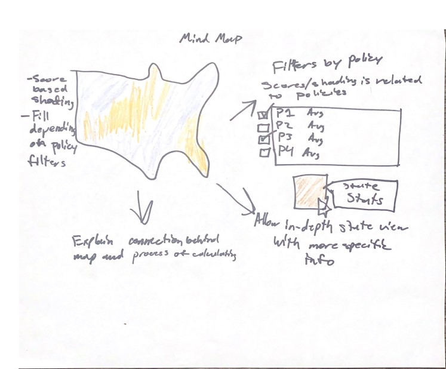

# cARTographers

## Introduction

We are the cARTographers, a duo of mapping students looking to research the effects that artistic education has on the American education system.

## Team Members

<!-- prettier-ignore -->
| Kai Colorado | Alex Haddad |
| :-: | :-: |
|  |  |
| I am a third year Sociology major with minors in Digital Humanities and Cognitive Science. In my free time I enjoy skateboarding and photography. I also enjoy burritos, as pictured above. | I'm a third year Computer Science major. Besides programming, I really enjoy watching TV shows and playing the piano in my spare time. I'm excited to learn how to properly analyze data and use it on a GIS map for this project. |

## Overview

Our project will be looking at differences in standardized test scores across states in relation to artistic education polices. We are aiming to study how artistic education impacts the academic careers of students. Artistic programs are usually one of the first to go when schools experience budget cuts. However, the arts are widely recognized as a defining aspect of human culture. We seek to investigate the possible benefits or drawbacks of artistic education on other aspects of academic performance. Through this analysis, we may better understand the role of art within the American school system.

## Methodology

Our project will involve mapping various data features and having a map layer for each. We will look at standardized scores and arts education policies per state. Having a layer for each data feature will allow users to look at the data that they want to see. We also want to show the correlation between these two feature categories to see if there is any sort of impact that one has on the other. Hopefully this will help people/users understand a relationship (if there is one) that was hard to see or visualize before.

## Workflow

| Week |                       Phase                        |
| :--: | :------------------------------------------------: |
|  2   |                 Complete Proposal                  |
|  3   |               Analyze and Clean data               |
|  4   |         Complete Basic Website UI / Design         |
|  5   | Implement Map and Single Data Feature Presentation |
|  6   |               Midterm Presentations                |
|  7   |            Add Map Layers for Our Data             |
|  8   |             Implement Correlation Data             |
|  9   |                 More Interactivity                 |
|  10  |            Finalize / Finishing Touches            |

## Technical Scope

-   **Git/GitHub**: A way to collaborate with each other and share our files easily.
-   **HTML**: Used to implement the main webpage skeleton.
-   **CSS**: Used to style the website.
-   **JavaScript**: Used to implement Leaflet and more interactive components for our website.
-   **Leaflet**: The main mapping library used to visualize geographical locations and overlay our data onto.
-   **Python**: May be used to handle/analyze the data and prepare it before it's used.

## Geographic Scope

Our project's geographic scope will be the United States, with each state being a data point. We may look into a more local or more global scope, separating by city/county or looking into other countries, but this will depend on the data we can collect.

## Data

The data we'll be using for this project includes state policies on arts education and per state standardized testing scores, both from national government sources.

The arts education data shows whether each state implements each of the 10 different policies. This data is from 2018. The standardized testing scores data includes testing for Mathematics, Reading, Science, and Writing. It has this data for many previous years, but the most relevant to us would be the years 2017 and 2019.

Data was manually converted to CSV or automatically saved as such if possible.

It can then be cleaned and analyzed with python into new CSVs with additional data, such as correlations, etc. Each data feature can be toggled as a layer on the map and additional info, like numerical values and a heatmap, will be shown as overlays. On hover, you can view an individual state's info for all the features that are available.

To map the states itself as polygons instead of as points on a map, we used JSON files that define geoJSON feature groups to use with Leaflet.

Our project data is available at: [Google Sheets](https://docs.google.com/spreadsheets/d/1BkXJjCqXiWi_ysFu2Jcnqbo0otuC-BwLhfqJNl1Fx18)

Links:

-   [Arts Education Policies](https://nces.ed.gov/programs/statereform/tab2_18.asp)
-   [Standardized Scores](https://www.nationsreportcard.gov/profiles/stateprofile)
-   [State GeoJSONs](https://eric.clst.org/tech/usgeojson/)

## UX Design

### Mind Maps

#### Alex

-   **Alex:** I mapped out the general flow of what a user can do on the site when they first go to it.

-   **Kai:** The notion of the user experience within our site is essential to a functional design, and Alex clearly addressed that. Building upon a blank map with filters that can gradually increase understanding is a great idea.

#### Kai

-   **Kai:** I was focused on how the data would be visualized on the map and how the user will interact with the map. It is essential that our user is able to quickly determine the purpose and function of our map, so I wanted to begin visualizing user interactions with the map and data displayed on the map.

-   **Alex:** Kai's mind map addresses the specific interactions a user can make and how our data displays on the map itself. Having a popup info panel on hover that gives more indepth data per state is a great idea that allows the user to see everything about a state at a glance. An explanation area that tells the user how and why we used the data is also a great addition.

### Crazy Eights

#### Alex

-   **Alex:** I visualized what the different overlays could possibly look like and drew out the most important aspects of the site, such as the layer selection, sidebar details, correlation statistics, etc. I also had the idea of an expandable sidebar so that the user can view more data without having to leave the map, but it can hide to avoid crowding the screen with two sidebars.

-   **Kai:** The expandable sidebar mechanic is very helpful due to the amount of filters and information that are involved in our map. By allowing the user to have more control over their experience and display, the expandable sidebar implements more features without overcrowding.

#### Kai

-   **Kai:** I began sketching what the individual aspects of our website will look like. I sketched two possible logos for our site as well as possible renditions of features within the map or webpage.

-   **Alex:** Having different tabs for certain things instead of trying to crowd everything on a single page is a great idea I hadn't even considered yet. And once again, the explanation of our mapping is very important. Having a key or a legend as an overlay on top of our map is also important because it helps the user keep track of what they're looking at. Our wireframes were clearly a mesh between our two ideas. We implemented almost all of our ideas from both crazy eights so far.

### Wireframes

#### Main

#### Art Policy Overlay

#### Hover Overlay

#### Average Scores Overlay

