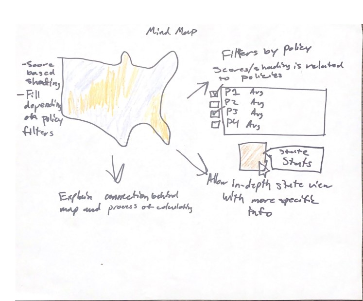
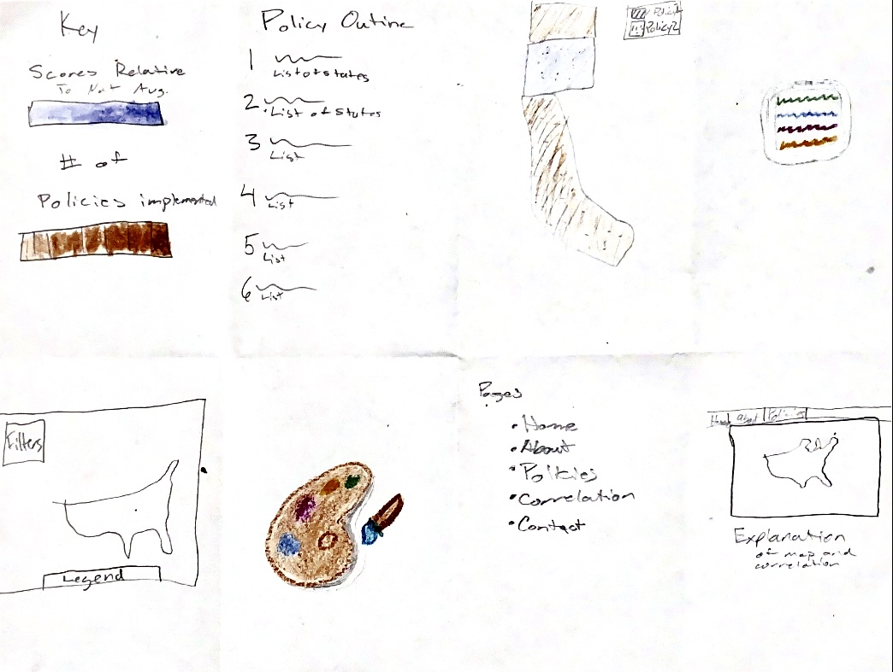

# Storyboard

## Mind Maps

### Alex

- **Alex:** I mapped out the general flow of what a user can do on the site when they first go to it.

- **Kai:** The notion of the user experience within our site is essential to a functional design, and Alex clearly addressed that. Building upon a blank map with filters that can gradually increase understanding is a great idea.

### Kai

- **Kai:** I was focused on how the data would be visualized on the map and how the user will interact with the map. It is essential that our user is able to quickly determine the purpose and function of our map, so I wanted to begin visualizing user interactions with the map and data displayed on the map.

- **Alex:** Kai's mind map addresses the specific interactions a user can make and how our data displays on the map itself. Having a popup info panel on hover that gives more indepth data per state is a great idea that allows the user to see everything about a state at a glance. An explanation area that tells the user how and why we used the data is also a great addition.

## Crazy Eights

### Alex

- **Alex:** I visualized what the different overlays could possibly look like and drew out the most important aspects of the site, such as the layer selection, sidebar details, correlation statistics, etc. I also had the idea of an expandable sidebar so that the user can view more data without having to leave the map, but it can hide to avoid crowding the screen with two sidebars.

- **Kai:** The expandable sidebar mechanic is very helpful due to the amount of filters and information that are involved in our map. By allowing the user to have more control over their experience and display, the expandable sidebar implements more features without overcrowding.

### Kai

- **Kai:** I began sketching what the individual aspects of our website will look like. I sketched two possible logos for our site as well as possible renditions of features within the map or webpage.

- **Alex:** Having different tabs for certain things instead of trying to crowd everything on a single page is a great idea I hadn't even considered yet. And once again, the explanation of our mapping is very important. Having a key or a legend as an overlay on top of our map is also important because it helps the user keep track of what they're looking at. Our wireframes were clearly a mesh between our two ideas. We implemented almost all of our ideas from both crazy eights so far.

## Wireframe

### Main

### Art Policy Overlay

### Hover Overlay

### Average Scores Overlay

