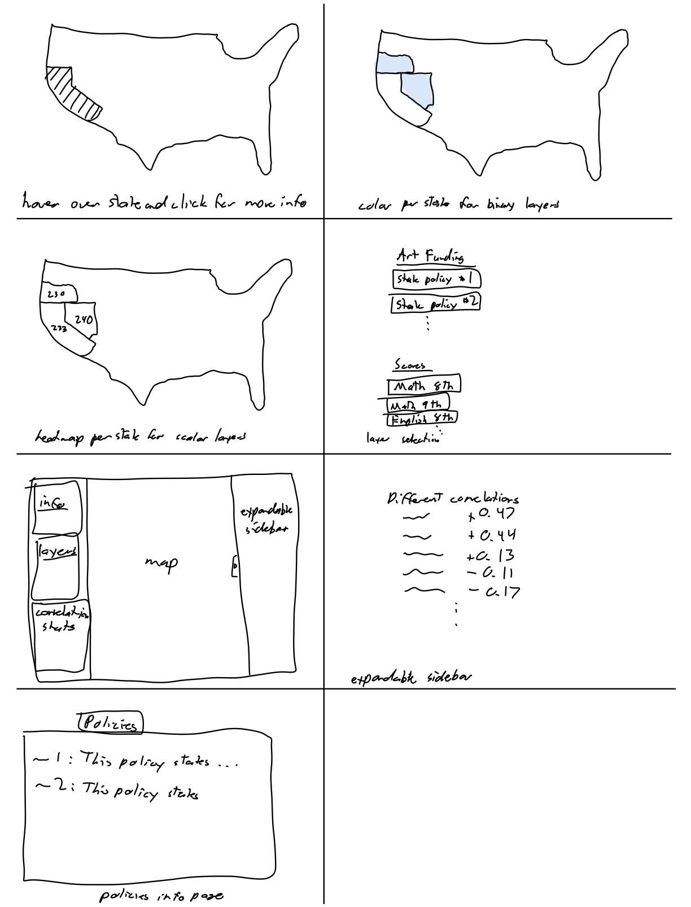

# Storyboard

## Mind Maps

### Alex

- **My Notes:** I mapped out the general flow of what a user can do on the site when they first go to it.

### Kai

## Crazy Eights

### Alex

- **My Notes:** I visualized what the different overlays could possibly look like and drew out the most important aspects of the site, such as the layer selection, sidebar details, correlation statistics, etc. I also had the idea of an expandable sidebar so that the user can view more data without having to leave the map, but it can hide to avoid crowding the screen with two sidebars.

### Kai

## Wireframe

### Main

### Art Policy Overlay

### Hover Overlay

### Average Scores Overlay

